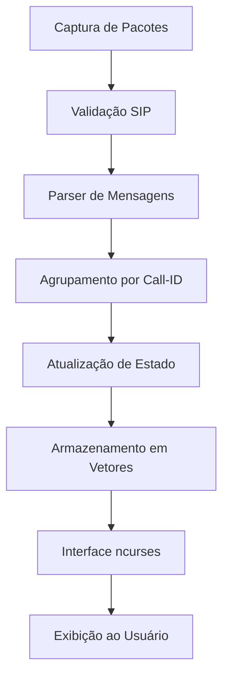

# Análise Técnica do Projeto sngrep

## Visão Geral do Projeto

O **sngrep** é uma ferramenta de linha de comando para captura e análise de mensagens SIP (Session Initiation Protocol) em tempo real. Desenvolvido em C, utiliza a biblioteca ncurses para fornecer uma interface TUI (Text User Interface) interativa.

## Arquitetura do Sistema

### Estrutura de Diretórios

```
sngrep/
├── src/                  # Código-fonte principal
│   ├── curses/          # Componentes da interface ncurses
│   ├── capture*.c       # Módulos de captura de pacotes
│   ├── sip*.c          # Processamento de mensagens SIP
│   └── main.c          # Ponto de entrada do programa
├── config/             # Arquivos de configuração
├── doc/               # Documentação
├── tests/            # Testes automatizados
└── pkg/             # Scripts de empacotamento
```

### Componentes Principais

#### 1. Sistema de Captura (capture.c, capture_*.c)
- **Responsabilidade**: Capturar pacotes de rede usando libpcap
- **Suporte a protocolos**: TCP, UDP, TLS (via OpenSSL/GnuTLS)
- **Funcionalidades**: 
  - Captura ao vivo de interfaces de rede
  - Leitura de arquivos PCAP
  - Decodificação de pacotes encapsulados (IP-in-IP)
  - Suporte a fragmentação IPv6

#### 2. Processamento SIP (sip.c, sip_*.c)
- **Parser SIP**: Analisa mensagens SIP usando regex
- **Gerenciamento de Chamadas**: 
  - Agrupa mensagens por Call-ID
  - Rastreia estado das chamadas (SETUP, INCALL, COMPLETED, etc.)
  - Correlaciona chamadas via X-Call-ID
- **Atributos SIP**: Sistema extensível de atributos para exibição

#### 3. Interface de Usuário (curses/ui_*.c)
- **Painéis disponíveis**:
  - Call List (ui_call_list.c) - Lista de chamadas
  - Call Flow (ui_call_flow.c) - Fluxo de mensagens
  - Call Raw (ui_call_raw.c) - Visualização bruta
  - Settings (ui_settings.c) - Configurações
  - Column Select (ui_column_select.c) - Seleção de colunas
  - Filters (ui_filter.c) - Filtros de exibição

#### 4. Sistema de Atributos (sip_attr.c)
- **Design Pattern**: Registry Pattern
- **Atributos disponíveis**:
  ```c
  SIP_ATTR_CALLINDEX    // Índice da chamada
  SIP_ATTR_SIPFROM      // Cabeçalho From
  SIP_ATTR_SIPTO        // Cabeçalho To
  SIP_ATTR_SRC          // Endereço de origem
  SIP_ATTR_DST          // Endereço de destino
  SIP_ATTR_CALLID       // Call-ID
  SIP_ATTR_METHOD       // Método/Resposta
  SIP_ATTR_CALLSTATE    // Estado da chamada
  // ... e muitos outros
  ```

### Fluxo de Dados



### Gerenciamento de Memória

O projeto utiliza:
- **Alocação dinâmica** para estruturas de dados
- **Vetores dinâmicos** (vector.c) para listas de mensagens/chamadas
- **Hash tables** para lookup rápido por Call-ID
- **Reference counting** implícito para mensagens compartilhadas

### Sistema de Teclas de Atalho

O sistema de keybinding é configurável e mapeado em `keybinding.c`:

```c
{ ACTION_SHOW_COLUMNS, "columns", { KEY_F(10), 't', 'T' }, 3 }
```

Onde:
- `ACTION_SHOW_COLUMNS` - ID da ação
- `"columns"` - Nome da ação
- `{ KEY_F(10), 't', 'T' }` - Teclas que disparam a ação
- `3` - Número de teclas alternativas

### Estados de Chamada SIP

```c
enum call_state {
    SIP_CALLSTATE_CALLSETUP = 1,  // INVITE enviado
    SIP_CALLSTATE_INCALL,          // ACK recebido
    SIP_CALLSTATE_CANCELLED,       // CANCEL recebido
    SIP_CALLSTATE_REJECTED,        // 4xx recebido
    SIP_CALLSTATE_DIVERTED,        // 3xx recebido
    SIP_CALLSTATE_BUSY,            // 486/600 recebido
    SIP_CALLSTATE_COMPLETED        // BYE recebido
}
```

### Processamento de Mensagens BYE

O processamento de desconexão ocorre em `call_update_state()`:

1. **Detecção do BYE**: Quando `reqresp == SIP_METHOD_BYE`
2. **Atualização de estado**: `call->state = SIP_CALLSTATE_COMPLETED`
3. **Captura de informações**: 
   - Quem desconectou (header From do BYE)
   - Código de resposta (200 OK, 487 Cancelled, etc.)

### Sistema de Colunas Configuráveis

As colunas são:
1. **Definidas** em `sip_attr.c` com metadados
2. **Selecionáveis** via interface F10
3. **Configuráveis** via arquivo `sngreprc`
4. **Renderizadas** em `call_list_line_text()`

### Otimizações de Performance

- **Lazy parsing**: Mensagens só são completamente parseadas quando necessário
- **Caching**: Atributos calculados são armazenados
- **Filtragem precoce**: Mensagens não-SIP são descartadas rapidamente
- **Limite de chamadas**: Rotação automática para evitar uso excessivo de memória

## Dependências Externas

- **libpcap**: Captura de pacotes
- **ncurses**: Interface de terminal
- **OpenSSL/GnuTLS**: Decodificação TLS (opcional)
- **PCRE**: Expressões regulares (opcional, fallback para POSIX regex)

## Compilação e Build System

O projeto suporta múltiplos sistemas de build:
- **Autotools** (configure.ac, Makefile.am)
- **CMake** (CMakeLists.txt)

## Testes

Suite de testes em `tests/`:
- Testes unitários para parsing SIP
- Testes de integração com arquivos PCAP
- Validação de interface ncurses

## Configuração

Arquivo `config/sngreprc`:
- Colunas padrão
- Filtros iniciais
- Cores e temas
- Comportamentos de captura

## Extensibilidade

O design permite fácil adição de:
- Novos atributos SIP
- Novos painéis de interface
- Novos métodos SIP
- Novos protocolos de transporte

## Considerações de Segurança

- Validação de entrada para evitar buffer overflow
- Limites de tamanho para payloads SIP
- Tratamento seguro de dados TLS
- Sanitização de strings para exibição

## Performance e Escalabilidade

- Suporta milhares de chamadas simultâneas
- Processamento assíncrono de pacotes
- Interface responsiva mesmo sob alta carga
- Uso eficiente de memória com rotação de chamadas antigas
